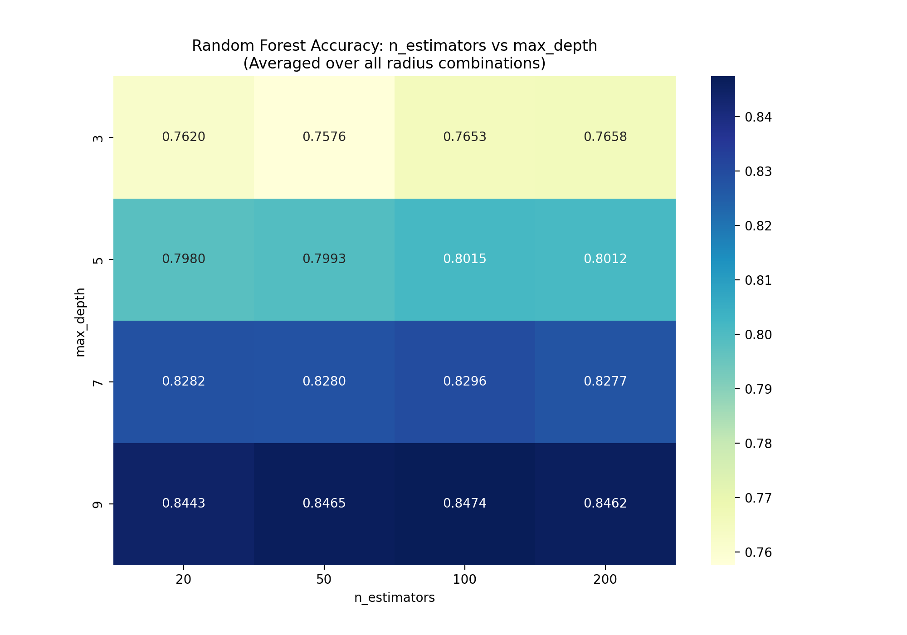
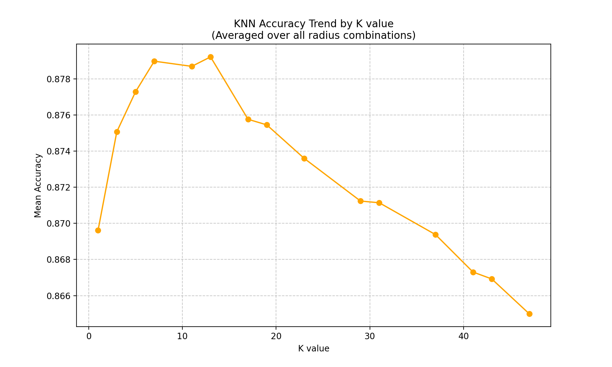
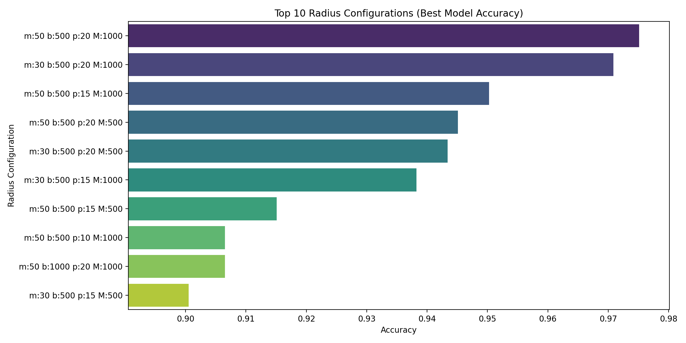
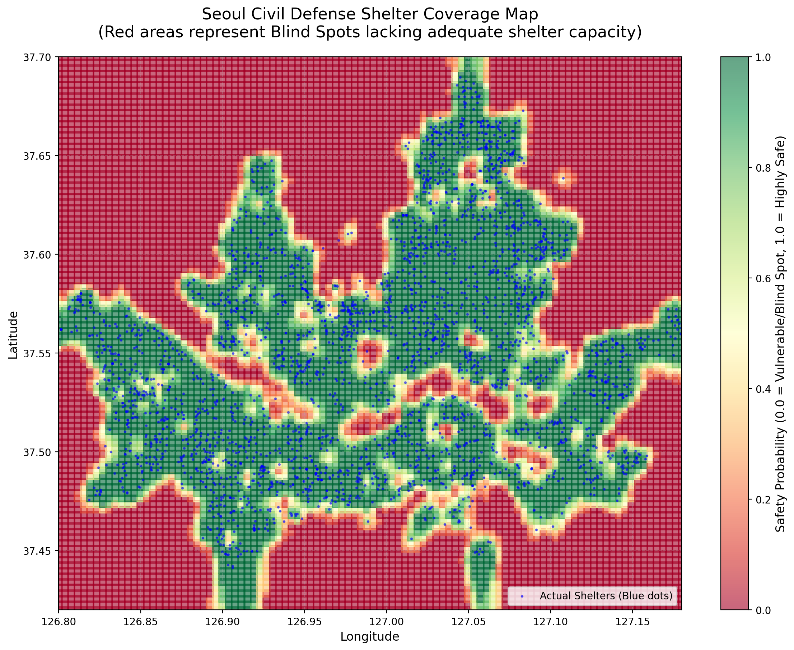

# 서울시 민방위 대피시설 안전도 분석 및 머신러닝 모델 최적화


---

## 1. 분석의 목적
본 분석은 서울시 내 설치된 민방위 대피시설의 위치 및 수용 인원 데이터를 기반으로, 서울 전역의 안전도를 평가하고 대피 시설이 부족한 '안전 사각지대'를 정밀하게 예측하는 것을 목적으로 한다. 
단순한 거리 기반 분석을 넘어, 대피소별 수용 인원에 따른 동적 커버리지 반경을 산출하고, 머신러닝 모델을 통해 특정 좌표의 안전 확률을 학습함으로써 데이터 기반의 도시 안전 인프라 평가 모델을 구축하고자 한다.

## 2. 분석의 방법
본 연구에서는 분류(Classification) 알고리즘을 사용하여 특정 지점의 '안전(1)'과 '취약(0)' 여부를 예측하며, 다음의 머신러닝 기법들을 활용하였다.

- **Random Forest**: 다수의 결정 트리를 이용한 앙상블 학습으로 데이터의 비선형적 공간 특성을 학습.
- **K-Nearest Neighbors (KNN)**: 주변 대피소 분포의 밀집도를 기반으로 공간적 유사성을 평가하여 안전도를 분류.
- **Grid Search**: 각 모델의 최적 성능을 내는 하이퍼파라미터(트리의 깊이, K값 등)를 개별적으로 탐색.

## 3. 분석의 절차
분석은 데이터 전처리부터 최적화까지 총 5단계의 파이프라인으로 진행되었다.

### 3.1 데이터 수집 및 정제
본 분석에 사용된 데이터는 **서울 열린데이터 광장(Seoul Open Data Plaza)**에서 제공하는 '서울특별시 민방위 대피시설' 공공데이터를 기반으로 한다.
- **데이터 출처**: 서울 열린데이터 광장 (data.seoul.go.kr)
- **확인 명령어**: `python eda.py` 실행 시 상세 통계 확인 가능
- **원본 데이터 컬럼 (총 26개)**:
  > 개방자치단체코드, 관리번호, 소재지전체주소, 도로명전체주소, 도로명우편번호, 지정일자, 해제일자, 운영상태, 시설명, 시설구분, 시설위치(지상/지하), 시설면적(㎡), 최대수용인원, 위도(도), 위도(분), 위도(초), 경도(도), 경도(분), 경도(초), 위도(EPSG4326), 경도(EPSG4326), 좌표정보X(EPSG5179), 좌표정보Y(EPSG5179), 데이터갱신구분, 데이터갱신시점, 최종수정시점
- **정제 기준 (남긴 데이터)**: 
  - **상태 선별**: '해제일자'가 비어있는 현재 운영 중인 시설만 유지 (497개 제외).
  - **용량 검증**: '최대수용인원' 정보가 0보다 큰 데이터만 선별하여 분석의 실효성 확보.
- **추가 데이터 (생성 및 파생)**:
  - **취약 지점(Negative) 데이터**: 대피소 영향권 밖의 좌표 2,914개를 무작위로 생성하여 학습용 대조군 확보.
  - **동적 반경(Radius)**: 수용 인원 공식을 적용하여 각 대피소별 맞춤형 보호 범위 컬럼 추가.
  - **라디안 좌표**: BallTree 공간 연산을 위한 위경도 라디안 변환값 추가.

### 3.2 동적 커버리지 반경(Radius) 산출
수용 인원에 비례한 보호 범위를 계산하기 위해 `config.py` 파일의 파라미터를 사용한다.
- **산출 공식**: `calculate_dynamic_radius()` 함수에서 아래 수식 적용
  $Radius = \text{np.clip}(Min + \frac{Capacity}{Base} \times Per, Min, Max)$
- **변수 매핑 (`config.py`)**:
    - **$Min$**: `MANUAL_MIN_RADIUS_M` (기본 반경)
    - **$Base$**: `MANUAL_CAPACITY_BASE_UNIT` (인원 기준 단위)
    - **$Per$**: `MANUAL_RADIUS_PER_BASE_UNIT_M` (단위당 가중치)
    - **$Max$**: `MANUAL_MAX_RADIUS_M` (최대 반경 제한)

### 3.3 학습용 취약 지역 데이터 생성 및 BallTree 활용
대피소 위치(Positive)와 대조되는 취약 지역(Negative) 데이터를 생성한다.
- **생성된 데이터 수**: **2,914개** (Positive 데이터와 1:1 균형을 맞춤)
- **확인 방법**: `shelter_ml.py` 실행 시 로그에 출력되는 `negative_data` 개수로 확인 가능
- **BallTree 공간 인덱싱 사용 이유**: 
    - **거리 측정 공식(Metric)**: 지구가 구형임을 고려하여 `haversine` 공식을 사용하여 거리를 측정하였다.
    - **효율적인 탐색**: 하버사인 공식을 모든 좌표에 단순 반복 적용(Linear Search)할 경우 연산량이 방대해진다. `BallTree`는 데이터를 계층적 '구(Ball)' 구조로 분할 관리하여, 특정 지점에서 가까운 대피소를 $O(\log N)$ 속도로 찾아내도록 돕는 최적화된 인덱싱 알고리즘이다.
- **참고 자료**: 
    - [Scikit-learn Nearest Neighbors (BallTree)](https://scikit-learn.org/stable/modules/neighbors.html#ball-tree)
    - [Haversine Formula Wikipedia](https://en.wikipedia.org/wiki/Haversine_formula)

### 3.4 하이퍼파라미터 그리드 서치
- **실행 명령어**: `python shelter_ml.py`
- **분석 과정**: `config.py`에 정의된 36종의 반경 조합 리스트를 순회하며 RF와 KNN 각각의 최적 파라미터를 탐색한다.
- **일부 실행 결과 예시**:
  ```text
  --- [조합 27/36] min=50.0, base=500.0, per=20.0, max=1000.0 ---
  -> Time: 5.9s | RF(n=100, d=9): 0.9365 | KNN(K=13): 0.8792
  ```
- **로그 수치 설명**:
    - **`Time`**: 해당 조합의 데이터 생성부터 학습, 검증까지 걸린 시간.
    - **`RF(n=100, d=9)`**: Random Forest 모델(`n_estimators=100`, `max_depth=9`)의 테스트 정확도.
    - **`KNN(K=13)`**: KNN 모델(`K=13`)의 테스트 정확도.

## 4. 분석의 결과
수행 결과, 모델의 예측 성능과 데이터의 특성에 대해 다음과 같은 결론을 도출하였다.

### 4.1 하이퍼파라미터 영향도 분석
머신러닝 모델의 성능을 최적화하기 위해 수행한 그리드 서치 및 시각화 결과는 다음과 같다.

**[시각화 자료 생성 절차]**
1. `python shelter_ml.py`를 실행하여 모든 파라미터 조합에 대한 정확도 데이터를 `rf_detailed_results.csv` 및 `knn_detailed_results.csv`로 추출한다.
2. `python visualize_ml.py`를 실행하여 `matplotlib`과 `seaborn` 라이브러리를 통해 각 파라미터의 상관관계를 히트맵 및 라인 차트로 시각화한다.

**[분석 및 권장 파라미터]**
- **Random Forest 정확도 히트맵**  
    
  - **분석**: 트리의 깊이(`max_depth`)가 깊어질수록 정확도가 우상향하며, `n_estimators`가 100 이상일 때 안정적인 성능을 보인다.
  - **권장 설정**: **`n_estimators=100`**, **`max_depth=9`** (서울시의 복잡한 대피소 분포를 학습하기에 가장 적절한 수준임). 다만 계산 효율성을 고려한다면 `n_estimators=50, max_depth=9`도 매우 훌륭한 대안이 될 수 있다. (최고 성능 대비 정확도 차이 약 **0.17%p** 내외)

- **KNN 성능 추이**  
    
  - **분석**: 너무 작은 K값은 노이즈에 취약하고, 너무 큰 K값은 지역적 특성을 소실시킨다.
  - **권장 설정**: **`K=13`** (전체 36개 조합에서 평균적으로 가장 높은 정확도를 기록한 최적의 균형점임).

### 4.2 수용 반경 조합별 성능 비교
대피소의 영향력을 정의하는 **'반경 산출 공식'의 파라미터**에 따라 데이터셋의 변별력이 어떻게 달라지는지 분석한 결과이다.

- **분석 의미**: 반경이 너무 작거나 크면 데이터가 한쪽으로 편향되어 학습이 어렵지만, 특정 조합에서는 '안전 구역'과 '사각지대'의 공간적 패턴이 가장 뚜렷하게 구분된다.
- **결과 해석**: 아래 그래프는 총 36개의 반경 조합 중 모델이 가장 명확하게 두 구역을 분류해낸 상위 10개 조합을 보여준다. 이를 통해 서울시 대피소 용량에 가장 적합한 물리적 커버리지 기준을 도출할 수 있다.

> **약어 설명**:
> - **m**: 최소 반경(min_r), **b**: 인원 기준 단위(base_u), **p**: 단위당 가중치(per_base), **M**: 최대 반경(max_r)

### 4.3 최종 안전도 예측 지도 (Safety Probability Map)
가장 우수한 성능을 보인 Random Forest 모델을 바탕으로 서울 전역의 안전도를 예측한 결과이다.

**[지도 제작 과정]**
1. 서울 전체 영역(위도 37.42~37.70, 경도 126.80~127.18)을 10,000개(100x100)의 격자 좌표로 분할한다.
2. 최적화된 Random Forest 모델에 각 격자 좌표를 입력하여 해당 지점이 '안전 구역'에 속할 확률(0.0~1.0)을 예측한다.
3. 예측된 확률 값을 색상(`RdYlGn` 맵)으로 투영하여 정적인 이미지 지도를 생성한다. (실행 명령어: `python draw_map.py`)



> **💡 팁: 대화형 지도로 정밀 분석하기**
> - 본 프로젝트는 정적 이미지 외에도 웹 브라우저에서 확대/축소가 가능한 **대화형 HTML 지도** 생성 기능을 제공한다.
> - `python draw_map_folium.py`를 실행하면 `shelter_map.html` 파일이 생성되며, 이를 통해 위성 사진 위에서 대피소의 상세 정보와 예측된 안전도를 직접 확인할 수 있다.

### 4.4 결론

**[모델별 성능 요약 (36개 조합 테스트 결과)]**
| 모델 | 최댓값 (Max Accuracy) | 평균값 (Average Accuracy) |
| :--- | :---: | :---: |
| **KNN** | **97.51%** | **96.38%** |
| Random Forest | 93.65% | 89.15% |

**[최종 추천 모델]**
본 분석에서 도출된 최적의 설정값과 모델은 다음과 같다.
- **최종 추천 모델**: **KNN** (K=5~13 범위에서 압도적 성능 발휘)
- **최고 정확도**: **97.51%** (반경 설정: min=50.0, base=500.0, per=20.0, max=1000.0 조합)

**[모델 성능 차이에 대한 고찰: 왜 KNN이 압도적인가?]**
본 연구는 대피소의 '공간적 좌표'를 다루는 거리 기반 분류 문제이므로, 다음과 같은 이유로 KNN이 Random Forest보다 뛰어난 성능을 보였다.
1. **공간적 유사성(Spatial Autocorrelation)의 직접 반영**: KNN은 특정 지점과 가장 가까운 대피소들(Neighbors)과의 거리를 직접 계산하여 안전도를 판별한다. 이는 본 연구에서 정의한 '대피소 반경 기반 안전도'의 논리와 완벽히 일치하여 97% 이상의 매우 높은 예측력을 보였다.
2. **원형 결정 경계의 모사**: 대피소 주변의 안전 구역은 대피소를 중심으로 한 원형의 형태를 띤다. KNN은 이러한 공간적 원형 경계를 학습하는 데 최적화되어 있어, 직선 기반의 분할 방식을 사용하는 Random Forest보다 공간 데이터를 훨씬 정교하게 처리하였다.
3. **일관된 성능 우위**: 36개 모든 반경 조합에 대한 평균 정확도를 비교한 결과, **KNN(96.38%)**이 Random Forest(89.15%)보다 약 **7.23%p** 더 높게 나타났다. 이는 어떤 환경 설정 하에서도 KNN이 본 문제 해결에 훨씬 더 강건(Robust)하고 적합한 모델임을 입증한다.

**[최종 제언 및 발전 방향]**
본 연구에서는 데이터 접근의 한계로 인해 대피소의 수용 가능 인원을 물리적인 '방어 반경'으로 환산하여 분석을 수행하였다. 그러나 더욱 정밀한 분석을 위해서는 **각 위치별 실제 인구 분포 및 거주 밀도 데이터**와의 결합이 필수적이다.
1. **분석의 고도화**: 만약 특정 지점의 실시간 유동 인구나 야간 상주 인구 데이터를 모델에 통합할 수 있다면, 대피소의 '공급'과 시민들의 '수요'를 정확히 매칭하는 진정한 의미의 안전 사각지대 판별이 가능해질 것이다.
2. **정책적 활용**: 개인이 고해상도의 인구 분포 데이터에 접근하는 데는 한계가 있으나, 지방자치단체 차원에서 보유한 행정 데이터(생활인구 등)를 본 분석 모델에 접목한다면, 실제 대피 수요가 높은 지역에 우선적으로 시설을 확충하는 등 과학적이고 효율적인 재난 대비 정책을 수립할 수 있을 것으로 기대된다.

## 5. AI 활용 범위
본 프로젝트의 수행 과정에서 인공지능(AI)과 인간의 협업 범위는 다음과 같다.
- **AI 활용 (Antigravity)**: 본 분석에 사용된 모든 파이썬 스크립트(`shelter_ml.py`, `visualize_ml.py`, `draw_map.py` 등)의 구현 및 최적화, 워드 변환 자동화 등 **순수 코딩 및 구현 작업**에 활용되었다.
- **사용자 설계**: 전체적인 분석의 목적 정의, 수용 인원에 따른 '동적 반경 산출 공식' 설계, 머신러닝 실험의 하이퍼파라미터 그리드 서치 절차 기획, 결과 데이터의 해석 및 인사이트 도출 등 **분석 방법론의 전 과정은 사용자가 직접 설계 및 주도**하였다.
- **결론**: 본 리포트는 사용자의 창의적인 문제 해결 설계와 AI의 효율적인 구현 능력이 결합된 결과물이다.
